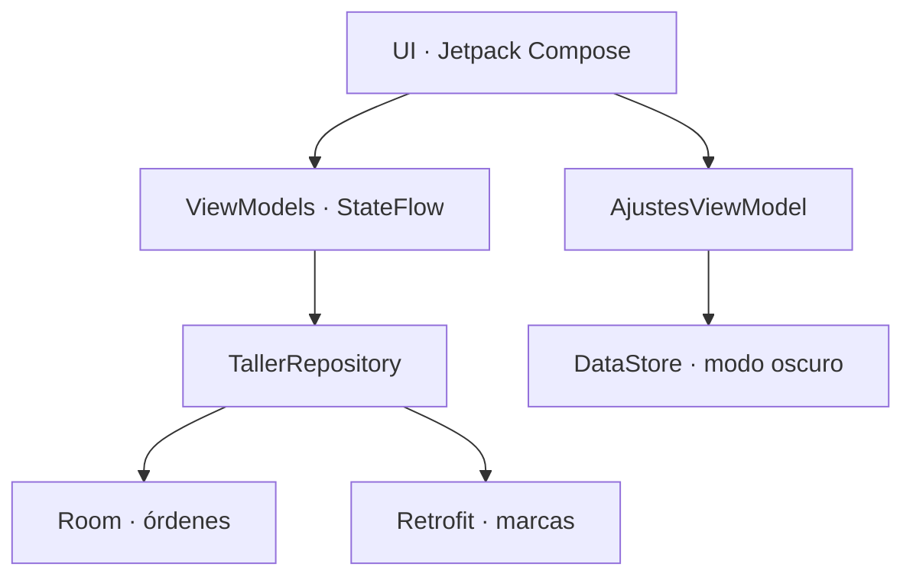
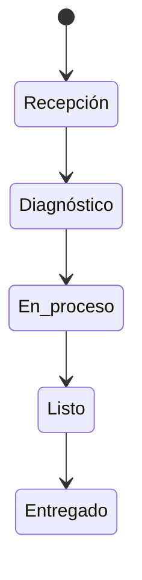

# Taller Recepción

Aplicación Android para registrar el ingreso de vehículos a un taller y acompañar cada orden desde la recepción hasta la entrega. El proyecto fue pensado para que la persona de recepción pueda trabajar con pocos pasos, incluso cuando el taller está ocupado.

**Autor:** Luis Barragán  
**Asignatura:** Aplicaciones móviles  
**Versión:** 1.0

## Problema que resuelve

En una recepción manual es fácil perder datos como el kilometraje, el motivo del ingreso o el estado actual del trabajo. Taller Recepción concentra esa información en una orden local y permite adjuntar una fotografía como evidencia del estado del vehículo.

## Funciones principales

- Crear una orden con cliente, vehículo, kilometraje, servicio y observaciones.
- Registrar empresa, contacto, serie, motor, color y entrega estimada.
- Marcar el inventario presente en exteriores, interiores, accesorios y componentes mecánicos.
- Tomar una fotografía durante la recepción.
- Consultar y buscar marcas reales desde la API pública vPIC.
- Ver las órdenes en una lista reactiva y revisar su detalle.
- Buscar por número de OT, cliente, placa, marca o modelo.
- Avanzar una orden por cinco estados: recepción, diagnóstico, en proceso, listo y entregado.
- Eliminar una orden con confirmación previa.
- Guardar los registros con Room aunque se cierre la app.
- Conservar la preferencia de modo oscuro con DataStore.
- Mostrar estados visibles de carga, éxito y error al consumir la API.

## Pantallas

1. **Inicio:** resumen por estado y lista de órdenes recientes.
2. **Nueva recepción:** formulario dividido en cliente, vehículo, servicio y evidencia.
3. **Detalle:** información completa y avance del estado de trabajo.
4. **Marcas:** consulta remota, búsqueda y reintento ante errores.
5. **Ajustes:** preferencia persistente de modo oscuro.

## Arquitectura

Se usa MVVM con un repositorio central. Las pantallas no consultan directamente la base de datos ni Retrofit; reciben estados de sus ViewModels. El repositorio implementa el acceso a las dos fuentes de datos de negocio.



### Flujo de una orden



## Organización del código

```text
com.luisbarragan.tallerrecepcion
├── data
│   ├── local          Room, DAO, entidad y conversiones
│   ├── preferences    DataStore
│   ├── remote         Retrofit y modelos de respuesta
│   └── repository     Implementación del repositorio
├── domain
│   ├── model          Modelos usados por la aplicación
│   └── repository     Contrato del repositorio
├── di                  Creación manual de dependencias
└── ui
    ├── components      Componentes reutilizables
    ├── navigation      Rutas y NavHost
    ├── screens         Pantallas Compose
    ├── theme           Colores y tema
    ├── util            Foto y formatos
    └── viewmodel       Estado y acciones de cada pantalla
```

## API utilizada

La pantalla **Marcas** usa Retrofit para consultar el servicio público vPIC de la NHTSA:

```text
GET https://vpic.nhtsa.dot.gov/api/vehicles/GetMakesForVehicleType/car?format=json
```

La respuesta se transforma a `MarcaVehiculo`, elimina identificadores repetidos y se ordena alfabéticamente. El ViewModel publica un único `MarcasUiState` con `cargando`, `marcas`, `filtro` y `error`.

## Persistencia

| Tecnología | Información | Motivo |
|---|---|---|
| Room | Órdenes de trabajo y URI de la foto | Son datos estructurados que se consultan y actualizan. |
| DataStore | Modo oscuro | Es una preferencia pequeña del usuario. |
| Archivo privado | Fotografía tomada | Conserva la imagen dentro del espacio de la app. |

## Hardware y permisos

La cámara se solicita en tiempo de ejecución cuando el usuario pulsa **Tomar fotografía**. Si se niega el permiso, aparece un mensaje y la orden puede guardarse sin foto. La URI se comparte con la aplicación de cámara mediante `FileProvider`, evitando exponer rutas internas.

## Cómo abrir y ejecutar

Requisitos recomendados:

- Android Studio con JDK 17.
- Android SDK 35.
- Emulador o teléfono con Android 8.0 (API 26) o superior.

Pasos:

1. Abrir Android Studio y elegir **Open**.
2. Seleccionar la carpeta `TallerRecepcion`.
3. Esperar a que Gradle termine la sincronización.
4. Elegir un dispositivo y pulsar **Run app**.

Desde terminal también se puede usar:

```bash
./gradlew testDebugUnitTest
./gradlew assembleDebug
```

La guía detallada para ejecutar, probar y firmar está en [`docs/GUIA_PASO_A_PASO.md`](docs/GUIA_PASO_A_PASO.md).

## Pruebas incluidas

- `EstadoOrdenTest`: comprueba el avance de los cinco estados.
- `OrdenMapperTest`: comprueba la conversión entre el modelo de dominio y la entidad Room.
- `DashboardUiStateTest`: comprueba la búsqueda por cliente, placa y número de orden.

## Capturas

La lista de capturas que se obtienen durante la validación en teléfono está en la carpeta [`capturas`](capturas). Debe mostrar inicio, formulario, detalle, API y modo oscuro.

## Documentos de apoyo

- [`docs/CUMPLIMIENTO_RUBRICA.md`](docs/CUMPLIMIENTO_RUBRICA.md): relación entre requisito y evidencia.
- [`docs/ANALISIS_Y_DIAGRAMAS.md`](docs/ANALISIS_Y_DIAGRAMAS.md): alcance, comparación y diagramas propios.
- [`docs/GUIA_PASO_A_PASO.md`](docs/GUIA_PASO_A_PASO.md): apertura, pruebas y firma.
- [`docs/GUIA_DEL_CODIGO.md`](docs/GUIA_DEL_CODIGO.md): explicación sencilla de los archivos importantes.
- [`docs/GUION_SUSTENTACION_15_MIN.md`](docs/GUION_SUSTENTACION_15_MIN.md): recorrido cronometrado para el video.
- [`docs/REPORTE_DE_VALIDACION.md`](docs/REPORTE_DE_VALIDACION.md): compilación, pruebas y firma verificadas.

## Decisiones tomadas

- Se creó una sola actividad y la navegación se resuelve con Compose Navigation.
- Se usa inyección manual en `AppContainer` para mostrar con claridad cómo se conectan las dependencias, sin agregar un framework innecesario al alcance del ejercicio.
- Las fotografías son opcionales porque una negativa de permiso no debe impedir la recepción.
- La API remota aporta un catálogo de consulta; las órdenes continúan funcionando sin conexión porque se almacenan localmente.
