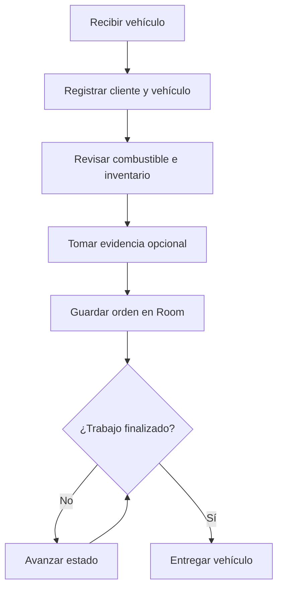
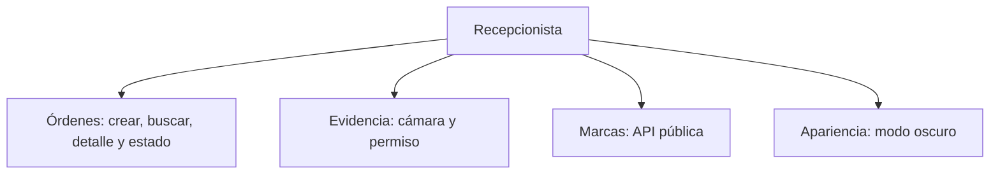
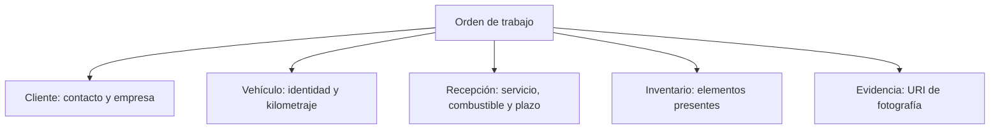
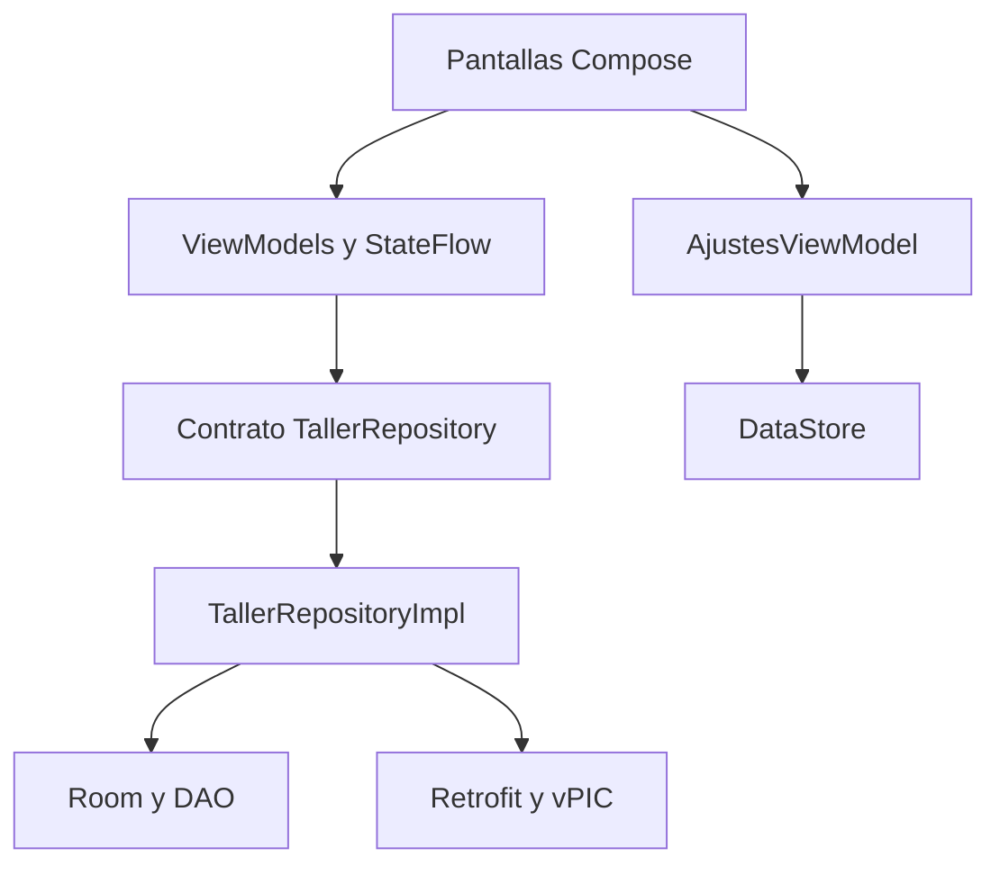
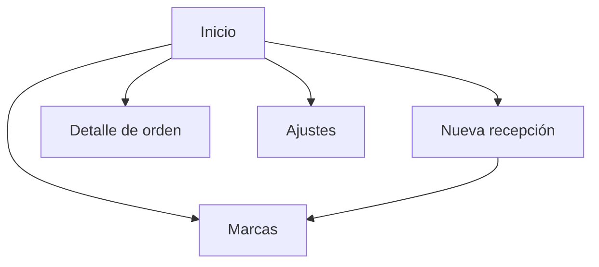

# Análisis y diagramas del proyecto

## 1. Criterio usado para definir el alcance

Se comparó la aplicación con un sistema académico más amplio de inventario y órdenes de trabajo para talleres. La comparación confirmó que el núcleo correcto es **crear, buscar, listar y consultar órdenes**, relacionando datos del cliente, vehículo y checklist de recepción.

La referencia estudiada era un sistema de escritorio, multiusuario y orientado también a bodega, ventas, repuestos, mecánicos y pagos. Taller Recepción es una app móvil individual y su alcance debe demostrar los requisitos de la asignatura sin convertirse en un ERP. Por eso se conservó el proceso operativo de recepción y se dejaron fuera los módulos financieros y administrativos.

| Elemento comparado | Decisión en la app | Justificación |
|---|---|---|
| Crear orden de trabajo | Incluido | Es el proceso central. |
| Buscar, listar y ver detalle | Incluido | Reduce el tiempo para ubicar una OT. |
| Datos de cliente | Incluido | Nombre, empresa, correo, teléfono y dirección. |
| Datos de vehículo | Incluido | Placa, marca, modelo, tipo, color, serie, motor y kilometraje. |
| Checklist de recepción | Incluido y ampliado | Registra exteriores, interiores, accesorios y componentes mecánicos. |
| Evidencia del ingreso | Incluida | La cámara aporta una prueba visual útil y cumple hardware/permisos. |
| Estados de la orden | Incluidos | Permiten seguir el trabajo hasta la entrega. |
| Presupuestos, precios y pagos | Excluidos | El usuario pidió eliminar presupuestos y no son necesarios para la rúbrica. |
| Stock y venta de repuestos | Excluidos | Constituyen otro módulo completo y exceden el alcance del semestre. |
| Usuarios, roles y mecánicos | Excluidos | La entrega es una aplicación individual y local. |
| Reportes administrativos | Mejora futura | No son obligatorios para demostrar la arquitectura móvil solicitada. |

## 2. Requerimientos funcionales propios

| ID | Requerimiento | Evidencia |
|---|---|---|
| RF-01 | Registrar una orden con datos válidos de cliente y vehículo. | Nueva recepción. |
| RF-02 | Registrar servicio, combustible, diagnóstico e inventario de ingreso. | Bloques 3 y 4 del formulario. |
| RF-03 | Adjuntar una fotografía opcional del vehículo. | Cámara con permiso en ejecución. |
| RF-04 | Listar y buscar órdenes por OT, cliente, placa, marca o modelo. | Inicio y barra de búsqueda. |
| RF-05 | Consultar el detalle de una orden. | Pantalla Detalle. |
| RF-06 | Avanzar el estado desde recepción hasta entregado. | Botón de avance en Detalle. |
| RF-07 | Consultar y filtrar marcas remotas. | Pantalla Marcas. |
| RF-08 | Recordar el modo oscuro. | Pantalla Ajustes. |
| RF-09 | Eliminar una orden solamente después de confirmar. | Diálogo en Detalle. |

## 3. Requerimientos no funcionales

- **Usabilidad:** formulario dividido en bloques y mensajes concretos de validación.
- **Persistencia:** las órdenes y la preferencia sobreviven al cierre de la app.
- **Tolerancia a fallos:** las órdenes locales funcionan sin internet; la API permite reintentar.
- **Privacidad:** las fotografías quedan en el almacenamiento privado y se comparten con `FileProvider`.
- **Compatibilidad:** Android 8.0 (API 26) o superior.
- **Mantenibilidad:** UI, ViewModel, repositorio y fuentes de datos están separados.

## 4. Proceso principal de negocio

Este flujo es más corto que el de un sistema empresarial porque no incorpora cotización, compra de repuestos, venta ni pago.

## 5. Casos de uso resumidos

La aplicación no necesita autenticación para esta versión porque se usa como proyecto individual en un solo dispositivo. Si más adelante se sincroniza con un servidor, el control de usuarios y roles sería una ampliación razonable.

## 6. Estructura lógica de una orden

En Room se guarda como una sola entidad `OrdenTrabajoEntity`. Esta decisión mantiene una fotografía histórica de cómo llegó el vehículo: si después cambia el teléfono del cliente o algún dato general, la orden anterior conserva lo escrito en el momento de la recepción.

### Campos persistidos por grupo

| Grupo | Campos principales |
|---|---|
| Identificación | id, fecha de ingreso, estado. |
| Cliente | nombre, empresa, correo, teléfono, dirección. |
| Vehículo | placa, marca, modelo, tipo, color, serie, motor, kilometraje. |
| Recepción | tipo de servicio, motivo, observación, combustible, diagnóstico y entrega estimada. |
| Inventario | elementos presentes separados para su recuperación. |
| Evidencia | URI de la fotografía privada. |

## 7. Arquitectura técnica

La diferencia importante frente a la referencia de escritorio es que aquí la arquitectura se organiza por responsabilidades de Android. El ViewModel nunca conoce el DAO ni la interfaz Retrofit; el repositorio funciona como límite entre dominio y datos.

## 8. Navegación

La barra inferior mantiene accesibles Inicio, Marcas y Ajustes. Nueva recepción y Detalle son pantallas secundarias y usan una flecha de regreso para no duplicar opciones.

## 9. Conclusión de la comparación

El proyecto va por buen camino porque conserva los componentes que definen una orden de taller: cliente, vehículo, checklist, búsqueda, detalle y seguimiento. La mejora aplicada fue incorporar los campos del formato real y un inventario de recepción. La reducción consciente de presupuestos, pagos, ventas, bodega y roles mantiene el proyecto defendible, comprobable y alineado con el examen de aplicaciones móviles.
